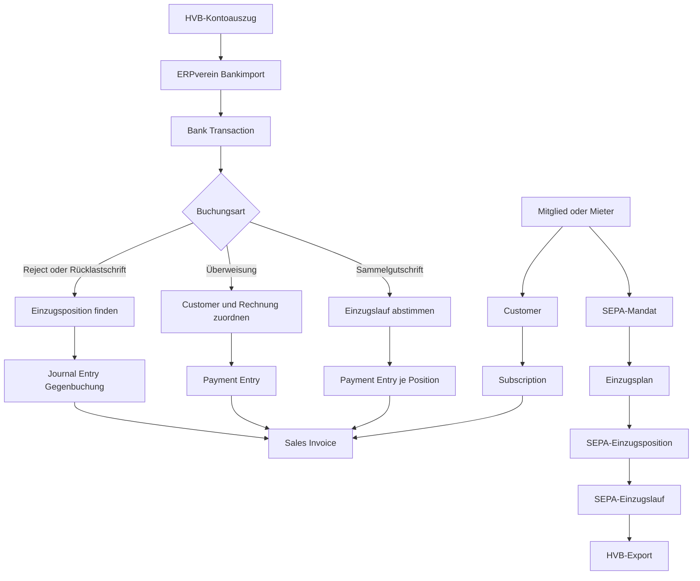
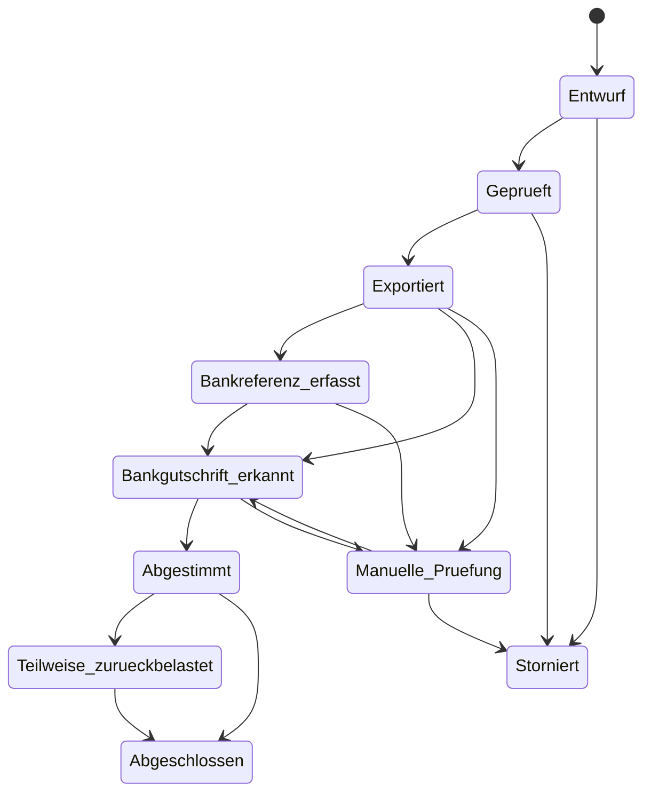
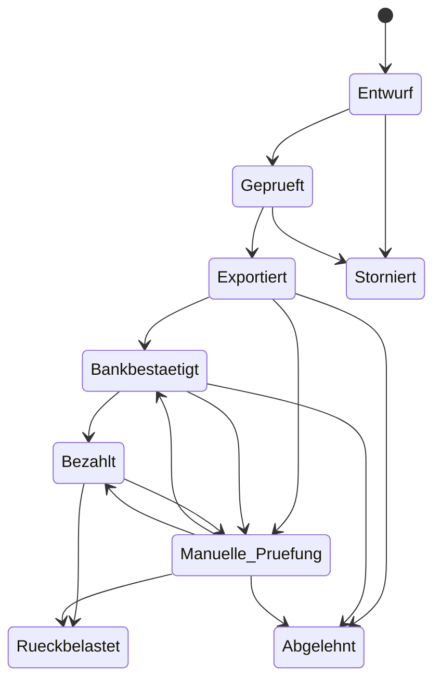

# ERPverein – Fach- und Implementierungsspezifikation

**Dokument:** `spec.md`  
**Status:** Entwurf zur fachlichen Freigabe  
**Version:** 0.1  
**Geltungsbereich:** ERPverein auf Frappe `v16.27.0` und ERPNext `v16.28.0`  
**Implementierungsstatus dieses Dokuments:** Nur Spezifikation; keine der hier beschriebenen neuen Funktionen ist durch dieses Dokument implementiert.  
**Datenschutz:** Dieses Dokument enthält ausschließlich abstrahierte oder synthetische Beispiele. Es enthält keine produktiven Namen, Bankverbindungen, Kontonummern, Beträge, Mandatsreferenzen, End-to-End-Referenzen oder Originalbuchungstexte.

---

## 1. Zweck des Dokuments

Dieses Dokument beschreibt den aktuellen Funktionsstand von ERPverein und die geplante Zielarchitektur für:

1. Mitglieds- und Mietabrechnung über ERPNext Subscriptions,
2. automatische Rechnungserzeugung,
3. die transparente Anzeige von Subscriptions, Rechnungen und Zahlungszuordnungen in `Mitglied` und `Mieter`,
4. SEPA-Mandate und Lastschrifteinzüge,
5. den Export von Lastschrift-Sammelaufträgen an die Hausbank,
6. den Import von Kontoauszügen,
7. die robuste Zuordnung realer Kontobewegungen zu Zahlungen und Rechnungen,
8. Selbstüberweiser und Zahlungen über mehrere Rechnungen,
9. Rejects und Rücklastschriften,
10. die historische Rekonstruktion ab dem 1. Januar 2016,
11. Datenschutz, Berechtigungen, Auditierbarkeit und Idempotenz.

Dieses Dokument ist die fachliche und technische Grundlage für spätere Implementierungen. Jede spätere Änderung soll einer Task-ID und einem Abnahmekriterium aus dieser Spezifikation zugeordnet werden können.

---

## 2. Ziele

### 2.1 Primäre Ziele

ERPverein soll einen einfachen, linearen und nachvollziehbaren Forderungs- und Zahlungsprozess abbilden:

```text
Stammdaten
→ Abrechnungsgrundlage
→ Rechnung
→ Einzugsauftrag oder Überweisung
→ Kontoauszug
→ Zahlung
→ Rechnungszuordnung
→ gegebenenfalls Rückbuchung
```

Dabei gelten folgende Ziele:

- ERPNext bleibt die einzige buchhalterische Wahrheit.
- Jede Rechnung, Zahlung, Rückbuchung und Kontobewegung bleibt als echtes ERPNext-Dokument nachvollziehbar.
- Eine Rechnung gilt erst nach einer bestätigten Kontobewegung und einer echten ERPNext-Zahlungszuordnung als bezahlt.
- Fehler sollen dort sichtbar werden, wo sie entstehen.
- Zwischen Rechnungserzeugung, Lastschriftplanung, Bankexport und Zahlungsbestätigung bestehen nur die fachlich notwendigen Abhängigkeiten.
- Mitglieds- und Mietvorgänge bleiben auch bei einem gemeinsamen Customer fachlich unterscheidbar.
- Die Benutzeroberfläche zeigt echte Dokumentketten und keine kopierten Statuswerte.
- Wiederholte Importe und wiederholte Jobs dürfen keine Doppelbuchungen erzeugen.
- Rücklastschriften löschen oder überschreiben keine historischen Zahlungen.
- Produktive Bankdaten gelangen nicht in Git, Dokumentation, Testfixtures oder technische Logs.

### 2.2 Qualitätsziele

Die Lösung soll:

- deterministisch,
- idempotent,
- fehlertolerant,
- auditierbar,
- permission-aware,
- datensparsam,
- modular,
- erweiterbar auf weitere Bankformate,
- und mit ERPNext-Standardmechanismen kompatibel sein.

---

## 3. Nicht-Ziele

Die erste Implementierung soll ausdrücklich nicht:

- eine zweite Buchhaltung neben ERPNext aufbauen,
- eigene offene Rechnungsbeträge speichern,
- Payment Ledger oder General Ledger nachbilden,
- Rechnungs- und Mandatsbeträge automatisch synchronisieren,
- einen Bankexport bereits als Zahlung behandeln,
- unsichere automatische Zuordnungen allein anhand eines Namens oder Betrags buchen,
- Kontoauszüge aus PDF als primäre Datenquelle verarbeiten,
- vollständige Bankdaten in Mitglied oder Mieter duplizieren,
- vorhandene ERPNext-Banking-Funktionen ersetzen,
- Rücklastschriftgebühren automatisch dem Schuldner weiterberechnen,
- mehrere Banken oder Geschäftskonten in der ersten Ausbaustufe automatisieren,
- oder sofort einen vollständigen `pain.008`-XML-Generator liefern.

Ein strukturierter SEPA-XML-Export ist als spätere Erweiterung vorgesehen. Das interne Datenmodell muss ihn ermöglichen, ohne darauf angewiesen zu sein.

---

## 4. Verbindliche Architekturentscheidungen

### ADR-001 – ERPNext ist das buchhalterische System of Record

Führende ERPNext-Objekte:

| Fachlicher Gegenstand | Führendes Objekt |
|---|---|
| wiederkehrende Abrechnungsgrundlage | `Subscription` |
| Forderung | `Sales Invoice` |
| tatsächliche Zahlung | `Payment Entry` |
| Zuordnung eines Zahlungsbetrags zu Rechnungen | `Payment Entry Reference` und Payment Ledger |
| tatsächliche Kontobewegung | `Bank Transaction` |
| Rückbuchung und Sonderbuchung | `Journal Entry` |
| Bankabstimmung | ERPNext Banking / Bank Reconciliation |
| Geschäftskonto oder Gegenkonto | `Bank Account` |
| Debitor | `Customer` |

ERPverein darf keine parallele Zahlungstabelle als buchhalterische Wahrheit einführen.

### ADR-002 – Gemeinsamer Customer

Eine natürliche oder juristische Person darf gleichzeitig `Mitglied` und `Mieter` sein und dafür denselben ERPNext-`Customer` verwenden.

Die fachlichen Vorgänge bleiben über folgende Herkunftsinformationen getrennt:

- Mitglied oder Mieter,
- Abrechnungsart,
- Subscription-Herkunft,
- Abrechnungslauf,
- SEPA-Mandat,
- Einzugsposition,
- zugehörige Rechnung.

### ADR-003 – Getrennte Mandate

Wenn dieselbe Person Mitglied und Mieter ist, werden Mitgliedsbeitrag und Miete über getrennte SEPA-Mandate und getrennte Einzugsvorgänge geführt. Dies gilt auch dann, wenn Kontoinhaber und IBAN identisch sind.

### ADR-004 – Rechnung und Lastschrift sind getrennte Prozesse

Die Rechnungskette lautet:

```text
Mitglied oder Mieter
→ Customer
→ Subscription
→ Sales Invoice
```

Die Lastschriftkette lautet:

```text
aktives SEPA-Mandat
→ Einzugsplan
→ Einzugsposition
→ Einzugslauf
→ Bankexport
→ Kontoauszug
→ Payment Entry
→ Sales Invoice
```

Eine Subscription erzeugt keine Lastschrift. Ein Mandat erzeugt keine Rechnung.

### ADR-005 – Der Lastschriftbetrag kommt ausschließlich aus dem Mandatsplan

Der Betrag einer Einzugsposition wird ausschließlich aus dem aktiven SEPA-Mandat und dessen Einzugsplan übernommen.

Beispiel:

```text
Rechnung:                 350 EUR
Betrag laut Mandatsplan:  300 EUR
bestätigte Zahlung:       300 EUR
offener Rechnungsbetrag:   50 EUR
```

Der fehlende Betrag kann später überwiesen, separat eingezogen oder nach einer Mandatsänderung bearbeitet werden.

### ADR-006 – Eine Einzugsposition gehört genau einer Rechnung

```text
Eine SEPA-Einzugsposition → genau eine Sales Invoice
Eine Sales Invoice       → null bis viele SEPA-Einzugspositionen
```

Eine Einzugsposition darf nicht auf mehrere Rechnungen aufgeteilt werden.

Eine normale Überweisung darf dagegen mehrere Rechnungen begleichen, sofern die Zahlungsbuchung fachlich und technisch zulässig ist.

### ADR-007 – Zahlungswirkung erst nach Kontoauszug

Ein Bankexport, ein angenommener PayGate-Auftrag oder ein interner Status „übermittelt“ reduziert keinen offenen Rechnungsbetrag.

Erst eine bestätigte `Bank Transaction` und ein eingereichter, zugeordneter `Payment Entry` oder `Journal Entry` verändern den offenen Betrag.

### ADR-008 – Variabler Verwendungszweck und stabile technische Referenz

Der Verwendungszweck ist variabel und menschenlesbar.

Er ist nicht der technische Primärschlüssel.

Jede Einzugsposition erhält zusätzlich eine:

- unveränderliche interne Positions-ID,
- stabile End-to-End-Referenz, sofern der Bankweg sie unterstützt,
- dauerhafte Mandatsreferenz als Mandatsschlüssel.

### ADR-009 – Rücklastschriften sind Gegenbuchungen

Die ursprüngliche Zahlung bleibt erhalten.

Eine Rücklastschrift wird als neue negative `Bank Transaction` und als neue buchhalterische Gegenbuchung erfasst. Die betroffene Rechnung wird dadurch wieder ganz oder teilweise offen.

### ADR-010 – Historische Rekonstruktion ab 2016

Ausgangspunkt ist ein geprüfter Eröffnungssaldo zum Beginn des 1. Januar 2016. Danach werden die Geschäftsvorfälle ab 2016 chronologisch nachgebucht.

Der Eröffnungssaldo darf keine bereits enthaltenen Bewegungen aus 2016 doppelt erfassen.

### ADR-011 – Bankdaten werden datensparsam gespeichert

Originale Kontoauszüge und Bankexporte werden als private Dateien gespeichert.

Sensible Werte werden nicht unnötig in weitere DocTypes kopiert. Wo ein unveränderlicher Nachweis erforderlich ist, werden bevorzugt verwendet:

- Links auf das führende Dokument,
- maskierte Werte,
- kryptografische Hashes,
- private Exportdateien,
- und technisch notwendige Referenzen.

---

## 5. Begriffe

### 5.1 Rechnung

Eine eingereichte ERPNext-`Sales Invoice`. Der offene Betrag wird ausschließlich von ERPNext berechnet.

### 5.2 Zahlung

Ein eingereichter ERPNext-`Payment Entry` oder in begründeten Sonderfällen ein `Journal Entry`, der über ERPNext-Referenzen auf eine oder mehrere Rechnungen wirkt.

### 5.3 Bank Transaction

Eine tatsächlich im Kontoauszug vorhandene Kontobewegung. Eine Bank Transaction ist noch keine Rechnung und noch keine Zahlungszuordnung.

### 5.4 SEPA-Mandat

Die Einzugsermächtigung mit Mandatsreferenz, Mandatsdatum, Kontoverbindung, Status und Einzugsplanung.

### 5.5 Einzugslauf

Ein fachlicher Sammelvorgang mit mehreren Einzugspositionen, der als eine oder mehrere Dateien an die Bank übergeben wird.

### 5.6 Einzugsposition

Ein einzelner geplanter Einzug für genau eine Rechnung, genau einen Customer und genau ein aktives Mandat.

### 5.7 Sammelgutschrift

Eine positive Bankbewegung, welche die Summe eines Lastschriftlaufs auf dem Geschäftskonto abbildet.

### 5.8 Reject

Eine nicht erfolgreich ausgeführte Einzugsposition. Ein Reject kann vor oder im unmittelbaren Zusammenhang mit der Sammelgutschrift auftreten.

### 5.9 Rücklastschrift

Eine spätere negative Bankbewegung, durch die ein bereits gutgeschriebener Einzug ganz oder teilweise zurückgegeben wird.

### 5.10 Zahlungszuordnung

Der einer konkreten Rechnung zugeordnete Teilbetrag eines Payment Entry oder Journal Entry.

---

## 6. Aktueller Implementierungsstand

### 6.1 Zielumgebung

Der aktuelle Repository-Stand zielt auf:

- Frappe `v16.27.0`,
- ERPNext `v16.28.0`,
- ERPverein `0.1.10`.

Die App setzt ERPNext als erforderliche App voraus.

### 6.2 Mitglied

`Mitglied` ist ein app-eigener Stammdaten-DocType.

Vorhanden sind unter anderem:

- Personendaten,
- Eintritts- und Austrittsdatum,
- Abrechnungsart,
- Jahresbeitrag,
- Beitragszahler,
- Customer-Link,
- SEPA-Mandat-Link.

`Mitglied` ist selbst kein Buchungsbeleg.

### 6.3 Mieter

`Mieter` ist ein app-eigener Stammdaten-DocType.

Vorhanden sind unter anderem:

- Stammdaten,
- Mietbeginn und Mietende,
- Abrechnungsdaten,
- Customer-Link,
- SEPA-Mandat-Link.

`Mieter` ist selbst kein Buchungsbeleg.

### 6.4 Customer-Synchronisation

Mitglied und Mieter werden serverseitig mit ERPNext-`Customer` verknüpft und synchronisiert.

Bereits implementiert sind:

- Validierung der Beziehungen,
- Synchronisation in beide Richtungen,
- Schutz vor widersprüchlichen Mehrfachverknüpfungen,
- Schutz vor Änderungen bei aktiven Mandaten,
- Buttons zum Synchronisieren und Öffnen des Customers.

Ein Customer darf gleichzeitig ein Mitglied und einen Mieter repräsentieren.

### 6.5 Abrechnungsassistenten

Vorhanden sind getrennte Assistenten für:

- Beitragsabrechnung,
- Mietabrechnung.

Sie erzeugen ERPNext-`Subscription`-Dokumente.

Die Subscriptions tragen bereits Herkunftsinformationen wie:

- Abrechnungsart,
- Generierungsschlüssel,
- Snapshot der Generierungsdaten,
- erzeugender Abrechnungslauf,
- fachliche Quelle und Rolle.

Die Generierung besitzt Wiederholungs- und Konfliktschutz.

### 6.6 Automatische Rechnungen

ERPNext Subscriptions erzeugen Sales Invoices.

Die Sales Invoice besitzt den Standardlink auf die Subscription sowie einen Leistungszeitraum.

### 6.7 SEPA-Mandate

Vorhanden sind:

- Mandatsreferenz,
- Mandatsdatum,
- Status,
- fachlicher Bezug auf Mitglied oder Mieter,
- Customer,
- ERPNext Bank Account,
- IBAN, BIC und Kontoinhaber über die Mandats-/Bankkonto-Logik,
- Einzugsintervall,
- Beginn und Ende des Einzugsplans,
- regelmäßiger Betrag oder einzelne Jahrestermine,
- nächster Solltermin,
- nächster effektiver Einzugstermin,
- Planungsstatus,
- Fingerprint der Einzugsplanung.

Pro Mitglied oder Mieter ist nur ein aktives Mandat zulässig.

### 6.8 Scheduler

Vorhanden sind:

- tägliche Aktualisierung der SEPA-Einzugsplanprojektionen,
- stündliche Bereinigung beziehungsweise Abstimmung veralteter Abrechnungsjobs.

### 6.9 Noch nicht implementiert

Noch nicht vorhanden sind:

- eingebettete Subscription-, Rechnungs- und Zahlungsansichten in Mitglied und Mieter,
- Einzugsläufe und Einzugspositionen,
- HVB-Export,
- End-to-End-Referenzen je Einzugsposition,
- Kontoauszugs-Vorverarbeitung für das konkrete HVB-Format,
- belastbarer Duplikatschutz für historische Kontoauszüge,
- automatische Zuordnung von Sammelgutschriften,
- Payment-Entry-Erzeugung je Einzugsposition,
- Selbstüberweiser-Matching,
- Reject- und Rücklastschriftprozess,
- historische Migration ab 2016.

---

## 7. Zielarchitektur



### 7.1 Trennung der Verantwortlichkeiten

| Schicht | Verantwortung |
|---|---|
| Mitglied/Mieter | fachliche Stammdaten |
| Customer | ERPNext-Debitor |
| Subscription | wiederkehrende Abrechnung |
| Sales Invoice | Forderung |
| SEPA-Mandat | Berechtigung, Bankdaten und Einzugsplan |
| Einzugslauf/-position | operative Bankeinreichung |
| Bank Transaction | reale Kontobewegung |
| Payment Entry | tatsächliche Zahlung |
| Journal Entry | Rückbuchung und Sonderfall |
| Payment Ledger | offene und bezahlte Beträge |
| Read-only-Sichten | Transparenz ohne Datenkopie |

---

## 8. Read-only-Sichten in Mitglied und Mieter

### 8.1 Ziel

Mitarbeitende sollen in `Mitglied` und `Mieter` erkennen können:

- welche Subscriptions existieren,
- welche Rechnungen erzeugt wurden,
- welche Beträge offen sind,
- welche Zahlungen eine Rechnung beglichen haben,
- welche Lastschrifteinzüge geplant oder ausgeführt wurden,
- und ob eine Zahlung später zurückgebucht wurde.

Die Ansichten dürfen keine buchhalterischen Daten kopieren oder editierbar machen.

### 8.2 Subscription-Sicht

Spalten:

- Subscription-ID,
- Status,
- aktiv/inaktiv,
- Startdatum,
- Enddatum,
- Subscription Plan,
- Abrechnungsart,
- fachliche Rolle,
- Abrechnungslauf,
- Customer,
- Link zum Originaldokument.

Filterlogik:

- primär über ERPverein-Subscription-Herkunft,
- nicht ausschließlich über Customer,
- damit Mitglieds- und Mietvorgänge bei gemeinsamem Customer getrennt bleiben.

### 8.3 Rechnungssicht

Spalten:

- Rechnungsnummer,
- Rechnungsdatum,
- Fälligkeit,
- Leistungszeitraum von/bis,
- Gesamtbetrag,
- offener Betrag,
- Status,
- Subscription,
- Abrechnungsart,
- Link zum Originaldokument.

### 8.4 Zahlungszuordnungssicht

Eine Zeile entspricht einer echten Zuordnung zwischen Zahlungsbeleg und Rechnung.

Spalten:

- Rechnung,
- Payment Entry oder Journal Entry,
- Belegstatus,
- Zahlungsdatum,
- Wertstellungsdatum, sofern bekannt,
- Gesamtbetrag des Zahlungsbelegs,
- dieser Rechnung zugeordneter Betrag,
- Bankreferenz,
- Verwendungszweck oder Beschreibung in gekürzter Form,
- Bank Transaction,
- Rückbuchungsstatus,
- Link zu allen Originaldokumenten.

### 8.5 Lastschriftsicht

Spalten:

- Einzugsposition,
- Einzugslauf,
- Mandat,
- Rechnung,
- Einzugsbetrag,
- Einzugsdatum,
- Status,
- Payment Entry,
- Rücklastschriftstatus,
- Link zu den Originaldokumenten.

### 8.6 Technische Umsetzung

- serverseitige, whitelisted und permission-aware APIs,
- keine Abfragen mit pauschaler Berechtigungsumgehung,
- Lazy Loading beim Öffnen des Formulars,
- paginierbare Tabellen,
- direkte Links zu ERPNext-Dokumenten,
- keine editierbaren Child Tables,
- keine dauerhafte Speicherung des offenen Betrags in Mitglied oder Mieter.

### 8.7 Abnahmekriterien

- Ein gemeinsamer Customer zeigt in Mitglied nur die Mitgliedsvorgänge und in Mieter nur die Mietvorgänge.
- Eine Rechnung mit zwei Teilzahlungen zeigt zwei Zahlungszuordnungen.
- Eine Zahlung über mehrere Rechnungen zeigt bei jeder Rechnung nur den jeweils zugeordneten Teilbetrag.
- Eine zurückgebuchte Zahlung bleibt sichtbar und die Rechnung wird wieder als offen angezeigt.
- Benutzer ohne Berechtigung für Accounts-Dokumente erhalten keine sensiblen Details.

### 8.8 Tasks

- `VIEW-001` Subscription-Sicht Mitglied
- `VIEW-002` Subscription-Sicht Mieter
- `VIEW-003` Rechnungssicht
- `VIEW-004` Zahlungszuordnungssicht
- `VIEW-005` Lastschriftsicht
- `VIEW-006` Pagination und Performance
- `VIEW-007` Berechtigungstests

---

## 9. SEPA-Exportprofil

### 9.1 Neuer DocType `SEPA Exportprofil`

Das Exportprofil kapselt bank- und unternehmensbezogene Einstellungen.

Vorgeschlagene Felder:

| Feldname | Typ | Pflicht | Bedeutung |
|---|---|---:|---|
| `profile_name` | Data | ja | sprechender Profilname |
| `company` | Link `Company` | ja | buchende Gesellschaft |
| `bank_account` | Link `Bank Account` | ja | Geschäftskonto |
| `bank` | Link `Bank` | ja | Hausbank |
| `creditor_identifier` | Data | ja | SEPA-Gläubiger-ID |
| `scheme` | Select | ja | zunächst `CORE`, später optional `B2B` |
| `export_format` | Select | ja | zunächst `HVB CSV/TSV`, später `pain.008` |
| `max_positions_per_file` | Int | ja | konfigurierbares Dateilimit |
| `default_purpose_template` | Small Text | nein | Standard-Verwendungszweck |
| `default_fee_account` | Link `Account` | ja | Bankgebührenkonto |
| `currency` | Link `Currency` | ja | zunächst `EUR` |
| `active` | Check | ja | Profil aktiv |
| `profile_version` | Data | ja | versioniert Parser/Exporter |
| `notes` | Small Text | nein | interne Hinweise |

### 9.2 Regeln

- Pro Geschäftskonto darf nur ein Profil gleicher Verfahrensart aktiv sein.
- Die Gläubiger-ID wird nicht am einzelnen Mandat dupliziert.
- Das Dateilimit ist konfigurierbar.
- Änderungen am Profil wirken nicht rückwirkend auf bereits exportierte Läufe.
- Jeder Export speichert die verwendete Profilversion.

### 9.3 Bank-Akzeptanztest

Vor produktivem Einsatz muss geklärt und dokumentiert werden:

- wie die individuelle End-to-End-Referenz über PayGate übergeben wird,
- welche Feldlängen und Zeichensätze gelten,
- welcher Sequenztyp akzeptiert wird,
- welche konkrete CSV-/TSV-Struktur erwartet wird,
- welche XML-Version gegebenenfalls unterstützt wird,
- und wie die bankseitige Laufreferenz zurückgegeben wird.

Ohne erfolgreichen Akzeptanztest darf kein produktiver Export freigegeben werden.

### 9.4 Tasks

- `PROFILE-001` DocType und Validierung
- `PROFILE-002` Gläubiger-ID
- `PROFILE-003` Dateilimit
- `PROFILE-004` Profilversionierung
- `PROFILE-005` Bank-Akzeptanztest

---

## 10. SEPA-Einzugslauf

### 10.1 Neuer DocType `SEPA Einzugslauf`

Ein Einzugslauf repräsentiert eine fachliche Sammlung von Einzugspositionen und ihre Übergabe an die Bank.

### 10.2 Benennung

Vorgeschlagene Naming Series:

```text
SEPA-LAUF-.YYYY.-.#####
```

### 10.3 Felder

| Feldname | Typ | Pflicht | Bedeutung |
|---|---|---:|---|
| `company` | Link `Company` | ja | Gesellschaft |
| `export_profile` | Link `SEPA Exportprofil` | ja | verwendetes Bankprofil |
| `bank_account` | Link `Bank Account` | ja | Geschäftskonto |
| `collection_date` | Date | ja | gewünschtes Einzugs-/Fälligkeitsdatum |
| `status` | Select | ja | Laufstatus |
| `position_count` | Int | read-only | Anzahl Positionen |
| `total_amount` | Currency | read-only | Summe Positionen |
| `currency` | Link `Currency` | ja | EUR |
| `export_format` | Data/Select | read-only | verwendetes Format |
| `export_profile_version` | Data | read-only | Profilversion |
| `export_file` | Attach | nein | private Exportdatei |
| `export_file_sha256` | Data | nein | Dateihash |
| `exported_at` | Datetime | nein | Exportzeitpunkt |
| `exported_by` | Link `User` | nein | exportierender Benutzer |
| `bank_customer_reference` | Data | nein | bankseitige Kundenreferenz |
| `bank_file_reference` | Data | nein | bankseitige Dateireferenz |
| `bank_order_reference` | Data | nein | bankseitige Auftragsreferenz |
| `settlement_bank_transaction` | Link `Bank Transaction` | nein | Sammelgutschrift |
| `settled_at` | Datetime | nein | Zeitpunkt der Abstimmung |
| `error_count` | Int | read-only | fehlerhafte Positionen |
| `notes` | Small Text | nein | nicht sensible Hinweise |

### 10.4 Statusmodell



Technische Optionswerte werden ASCII-kompatibel gespeichert; die UI darf deutsche Labels anzeigen.

### 10.5 Regeln

- Ein exportierter Lauf ist in seinen finanziellen Kerndaten unveränderlich.
- Änderungen nach Export erfordern einen neuen Lauf.
- Die Summe wird ausschließlich aus Positionen berechnet.
- Eine Exportdatei wird privat gespeichert.
- Ein identischer Exporthash darf nicht unbemerkt einem anderen fachlichen Inhalt entsprechen.
- Eine Sammel-Bank-Transaction darf nur einem Einzugslauf zugeordnet sein.
- Eine Abweichung zwischen Bankbetrag und erwarteter Summe führt zu `Manuelle Prüfung`.

### 10.6 Abnahmekriterien

- Ein Lauf kann ohne Positionen nicht geprüft oder exportiert werden.
- Ein exportierter Lauf kann nicht stillschweigend verändert werden.
- Dateihash, Benutzer, Zeitpunkt und Profilversion sind nachvollziehbar.
- Wiederholtes Ausführen der Settlement-Logik erzeugt keine zusätzlichen Zahlungen.

### 10.7 Tasks

- `DD-RUN-001` DocType
- `DD-RUN-002` Statusmaschine
- `DD-RUN-003` Summenberechnung
- `DD-RUN-004` Export-Sperren
- `DD-RUN-005` Bankreferenzen
- `DD-RUN-006` Audit und Berechtigungen

---

## 11. SEPA-Einzugsposition

### 11.1 Neuer DocType `SEPA Einzugsposition`

Die Position ist ein eigenständiger DocType und keine reine Child Table.

Begründung:

- Sie besitzt einen eigenen Lebenszyklus.
- Sie wird einzeln bezahlt, abgelehnt oder zurückgegeben.
- Payment Entry, Bank Transaction und Journal Entry müssen direkt auf sie verweisen können.
- Sie benötigt eine unveränderliche technische Referenz.
- Sie muss unabhängig von der Darstellung eines Laufs auditierbar sein.

### 11.2 Benennung

Vorgeschlagene Naming Series:

```text
SEPA-POS-.YYYY.-.#######
```

### 11.3 Felder

| Feldname | Typ | Pflicht | Bedeutung |
|---|---|---:|---|
| `collection_run` | Link `SEPA Einzugslauf` | ja | übergeordneter Lauf |
| `source_doctype` | Link `DocType` | ja | `Mitglied` oder `Mieter` |
| `source_name` | Dynamic Link | ja | fachliche Quelle |
| `customer` | Link `Customer` | ja | Debitor |
| `sepa_mandate` | Link `SEPA Mandat` | ja | aktives Mandat |
| `sales_invoice` | Link `Sales Invoice` | ja | genau eine Rechnung |
| `collection_date` | Date | ja | Ausführungsdatum |
| `amount` | Currency | ja | Betrag aus Mandatsplan |
| `currency` | Link `Currency` | ja | EUR |
| `purpose` | Small Text | ja | variabler Verwendungszweck |
| `internal_reference` | Data | ja, unique | interne stabile Referenz |
| `end_to_end_reference` | Data | ja, unique | stabile Bankreferenz |
| `mandate_reference_snapshot` | Data | ja | Mandatsreferenz bei Export |
| `mandate_date_snapshot` | Date | ja | Mandatsdatum bei Export |
| `debtor_iban_hash` | Data | ja | Hash der normalisierten IBAN |
| `debtor_iban_last4` | Data | ja | maskierte Anzeige |
| `sequence_type` | Select | ja | bankseitig validierter Typ |
| `prenotification_status` | Select | ja | Vorabinformation |
| `prenotification_date` | Date | nein | Versand-/Informationsdatum |
| `status` | Select | ja | Positionsstatus |
| `payment_entry` | Link `Payment Entry` | nein | bestätigte Zahlung |
| `settlement_bank_transaction` | Link `Bank Transaction` | nein | Sammelgutschrift |
| `return_bank_transaction` | Link `Bank Transaction` | nein | Reject/Rücklastschrift |
| `return_journal_entry` | Link `Journal Entry` | nein | Gegenbuchung |
| `return_principal_amount` | Currency | nein | zurückgegebener Hauptbetrag |
| `return_fee_amount` | Currency | nein | Bankgebühren |
| `return_reason_code` | Data | nein | normalisierter Grund |
| `return_reason_text` | Small Text | nein | gekürzte, sensible-freie Beschreibung |
| `processing_error` | Small Text | nein | maskierte Fehlermeldung |

### 11.4 Statusmodell



### 11.5 Betragsregeln

Vor Erstellung:

- Das Mandat ist aktiv.
- Die fachliche Quelle stimmt mit dem Mandat überein.
- Der Customer stimmt mit Rechnung und Mandat überein.
- Die Rechnung ist eingereicht.
- Die Rechnung besitzt einen positiven offenen Betrag.
- Der Betrag stammt aus dem fälligen Mandatsplan.
- Das Einzugsdatum liegt nicht nach Austritt beziehungsweise Mietende.
- Der Einzug ist nicht bereits durch eine andere Position mit gleichem Planungsschlüssel abgebildet.

Vergleich mit dem Rechnungsrest:

| Bedingung | Ergebnis |
|---|---|
| Mandatsbetrag kleiner als Rechnungsrest | Position zulässig, Rechnung bleibt später teilweise offen |
| Mandatsbetrag gleich Rechnungsrest | Position zulässig |
| Mandatsbetrag größer als Rechnungsrest | Konflikt, keine automatische Position |
| kein Rechnungsrest | keine Position |
| keine eindeutige Rechnung | manuelle Prüfung |

Eine automatische Kürzung des Mandatsbetrags ist nicht zulässig.

### 11.6 Rechnungsauswahl

Für einen fälligen Mandatstermin wird eine geeignete offene Rechnung gesucht:

1. gleiche fachliche Quelle,
2. gleicher Customer,
3. richtige Abrechnungsart,
4. eingereichte Rechnung,
5. offener Betrag,
6. Rechnungsperiode passt zum Einzugstermin,
7. älteste passende Fälligkeit zuerst.

Wenn mehrere Rechnungen gleich plausibel sind, wird keine automatische Position erzeugt.

### 11.7 Vorabinformation

Eine Position darf nur exportiert werden, wenn die erforderliche Vorabinformation dokumentiert ist.

Mögliche Statuswerte:

- `Nicht erforderlich`,
- `Geplant`,
- `Versendet`,
- `Dauerplan mitgeteilt`,
- `Manuell bestätigt`.

Da Rechnungsbetrag und Lastschriftbetrag voneinander abweichen können, gilt eine Rechnung nicht automatisch als ausreichende Vorabinformation.

### 11.8 Idempotenz

Ein fachlicher Generierungsschlüssel muss mindestens enthalten:

```text
Mandat
+ Solltermin
+ Betrag
+ Rechnung
+ fachliche Quelle
```

Derselbe Schlüssel darf nur eine aktive Einzugsposition besitzen.

### 11.9 Tasks

- `DD-ITEM-001` DocType
- `DD-ITEM-002` stabile Referenzen
- `DD-ITEM-003` Rechnungsfinder
- `DD-ITEM-004` Betragsprüfung
- `DD-ITEM-005` Austritt/Mietende
- `DD-ITEM-006` Vorabinformation
- `DD-ITEM-007` Idempotenz
- `DD-ITEM-008` Statusmaschine
- `DD-ITEM-009` Datenschutzfelder

---

## 12. Erzeugung von Einzugsläufen

### 12.1 Benutzerfluss

```text
1. Zeitraum und Exportprofil wählen
2. fällige Mandatstermine ermitteln
3. passende offene Rechnungen suchen
4. Vorschau mit erfolgreichen Positionen und Konflikten anzeigen
5. Benutzer bestätigt die Auswahl
6. Lauf und Positionen im Status Entwurf erzeugen
7. Lauf prüfen
8. Export erzeugen
```

### 12.2 Vorschau

Die Vorschau trennt:

- erzeugbare Positionen,
- fehlende Rechnungen,
- Mandatsbetrag größer Rechnungsrest,
- inaktives oder unvollständiges Mandat,
- fehlende Vorabinformation,
- Datum nach Austritt oder Mietende,
- bereits vorhandene Position,
- nicht eindeutige Rechnung.

### 12.3 Keine versteckten Customer-Abhängigkeiten

Eine Position darf nur von fachlich notwendigen Daten abhängen:

- Customer-Link,
- Rechnung,
- Mandat,
- Bank Account,
- Betrag,
- Termin,
- fachliche Quelle.

Nicht relevante Customer-Felder dürfen den Einzug nicht blockieren.

### 12.4 Transaktionsverhalten

- Die Vorschau schreibt nichts.
- Die bestätigte Generierung ist idempotent.
- Konflikte verhindern nicht die Erstellung anderer eindeutiger Positionen.
- Jede ausgelassene Position erhält einen nachvollziehbaren Grund.
- Ein Lauf mit Teilfehlern bleibt im Entwurf und kann geprüft werden.

### 12.5 Tasks

- `DD-GEN-001` Vorschau-API
- `DD-GEN-002` Rechnungsfindung
- `DD-GEN-003` Konfliktmodell
- `DD-GEN-004` idempotente Erstellung
- `DD-GEN-005` UI-Assistent
- `DD-GEN-006` Berechtigungen

---

## 13. HVB-Export

### 13.1 Erste Ausbaustufe

Unterstützt wird zunächst das für den bestehenden PayGate-Prozess geeignete CSV-/TSV-Format.

Die fachlichen Positionsdaten umfassen mindestens:

- Zahlungspflichtiger,
- Zahlungspflichtiger IBAN,
- Mandatsreferenz,
- Mandatsdatum,
- Betrag,
- Verwendungszweck.

Weitere Bankdaten werden über Exportprofil oder nachgelagerte PayGate-Schritte bereitgestellt.

### 13.2 Formatneutraler Kern

Der Exportservice erhält kanonische Positionsdaten und übergibt sie an einen formatspezifischen Writer:

```text
CollectionExportService
├── HVBDelimitedExportWriter
└── Pain008ExportWriter      [spätere Ausbaustufe]
```

### 13.3 Verwendungszweck

Der Verwendungszweck:

- kann aus einer Vorlage erzeugt werden,
- kann vor Export pro Position bearbeitet werden,
- ist nach Export unveränderlich,
- enthält keine zwingende technische Identität,
- darf eine kurze technische Referenz zusätzlich enthalten, falls kein strukturiertes End-to-End-Feld übertragen werden kann.

Vorgeschlagene Template-Platzhalter:

```text
{invoice}
{customer}
{source_id}
{period_from}
{period_to}
{collection_date}
{internal_reference}
```

Nicht jeder Platzhalter muss in der Standardvorlage verwendet werden.

### 13.4 End-to-End-Referenz

Anforderungen:

- höchstens bankseitig zulässige Länge,
- ASCII-kompatibel,
- eindeutig,
- unveränderlich,
- keine direkt lesbare IBAN oder Personendaten,
- aus einer internen ID plus Prüfsuffix ableitbar,
- niemals wiederverwenden.

Beispiel ausschließlich synthetisch:

```text
EV26A1B2C3D4E5
```

### 13.5 Exportvalidierung

Ein Lauf kann nur exportiert werden, wenn:

- alle Positionen geprüft sind,
- Profileinstellungen vollständig sind,
- Gläubiger-ID vorhanden ist,
- Geschäftskonto vorhanden ist,
- Mandate aktiv sind,
- Rechnungen weiterhin offen sind,
- Beträge weiterhin zulässig sind,
- Vorabinformationen dokumentiert sind,
- Referenzen eindeutig sind,
- alle Positionen dasselbe Profil und kompatible Ausführungsdaten verwenden.

Die Rechnung wird unmittelbar vor Export erneut geprüft. Eine zwischenzeitlich bezahlte Rechnung führt zum Konflikt.

### 13.6 Dateiaufteilung

Wenn das konfigurierte Dateilimit überschritten wird:

- bleibt der fachliche Einzugslauf erhalten,
- der Export erzeugt mehrere nummerierte Dateien,
- jede Datei erhält einen eigenen Hash und eine eigene Bankdateireferenz,
- Positionen werden einer Exportdatei zugeordnet,
- die Summe aller Dateien entspricht dem Lauf.

Falls dies die Komplexität der ersten Umsetzung unverhältnismäßig erhöht, darf ein Lauf initial auf das Dateilimit begrenzt werden. Dies muss im UI klar angezeigt werden.

### 13.7 Speicherung

- Exportdatei als private `File`,
- SHA-256-Hash,
- Exportzeitpunkt,
- Benutzer,
- Profilversion,
- Anzahl Positionen,
- Summe,
- unveränderliche Dateizuordnung je Position.

### 13.8 Tasks

- `EXP-001` kanonisches Exportmodell
- `EXP-002` HVB-Writer
- `EXP-003` Verwendungszwecktemplates
- `EXP-004` End-to-End-Referenzen
- `EXP-005` Validierung
- `EXP-006` private Speicherung
- `EXP-007` Dateihash
- `EXP-008` Dateiaufteilung
- `EXP-009` synthetische Akzeptanzdatei
- `EXP-010` PayGate-Akzeptanztest

---

## 14. Kontoauszugsimport

### 14.1 Grundsatz

Kontoauszüge werden als maschinenlesbarer Export importiert.

Der aktuell untersuchte Bankexport enthält abstrahiert:

- Kontoidentifikation,
- Buchungsdatum,
- Wertstellung,
- ausführlichen Text,
- standardisierten Buchungstext,
- Kundenreferenz,
- Partnerbank,
- Partnerkonto beziehungsweise Partner-IBAN,
- Partnername,
- Betrag,
- SEPA-Gläubiger-ID,
- SEPA-End-to-End-Referenz,
- SEPA-Mandatsreferenz,
- Primanota,
- Textschlüssel,
- Änderungszeitpunkt,
- zusätzliche teilweise unbenannte Rohfelder.

Keine produktiven Beispielwerte werden in Code, Tests oder Dokumentation übernommen.

> **Hinweis zum Erstimport:** Die in diesem Abschnitt beschriebenen Umsatzimportfelder basieren auf dem derzeit vorliegenden Bankexport und dienen zunächst der historischen Erstübernahme. Sie sind keine endgültige Schnittstellendefinition. Das finale Quellformat, die verfügbaren Spalten und das Feldmapping werden angepasst, sobald der Export für den laufenden Bankbetrieb feststeht. Der Importer muss deshalb profil- und versionsbasiert aufgebaut werden und darf nicht fest an die Struktur des Erstimports gekoppelt sein.

### 14.2 Technische Besonderheiten

Das Importprofil muss unterstützen:

- Tabulator als mögliches Trennzeichen,
- deutsche Dezimalkommas,
- deutsche Datumsformate,
- Datum/Uhrzeit,
- leere oder nur technisch befüllte Felder,
- geschützte Leerzeichen,
- mehrfach vorkommende Inhalte,
- teilweise unbenannte Spalten,
- Transliterationen wie `Ue` oder `Rueck`,
- positive und negative Beträge in derselben Spalte.

### 14.3 Neuer DocType `ERPverein Bankimport`

Ein app-eigener Importlauf dient als sichere Vorverarbeitung und Audit-Hülle. Das Ergebnis bleiben Standard-`Bank Transaction`-Dokumente.

Felder:

| Feldname | Typ | Bedeutung |
|---|---|---|
| `company` | Link `Company` | Gesellschaft |
| `bank_account` | Link `Bank Account` | Geschäftskonto |
| `import_profile` | Select/Data | HVB-Profilversion |
| `source_file` | Attach | private Originaldatei |
| `source_file_sha256` | Data unique | Dateihash |
| `status` | Select | Entwurf, Validiert, Importiert, Teilfehler, Fehler |
| `row_count` | Int | Zahl Datenzeilen |
| `new_transaction_count` | Int | neu erzeugte Bewegungen |
| `duplicate_count` | Int | erkannte Duplikate |
| `error_count` | Int | fehlerhafte Zeilen |
| `deposit_total` | Currency | Summe Gutschriften |
| `withdrawal_total` | Currency | Summe Belastungen |
| `started_at` | Datetime | Start |
| `completed_at` | Datetime | Ende |
| `parser_version` | Data | Parser-Version |
| `error_report` | Attach | private, bereinigte Fehlerdatei |

### 14.4 Kanonisches Importmodell

Jede Quellzeile wird zunächst in ein internes Modell normalisiert:

```text
source_row_number
booking_date
value_date
signed_amount
transaction_type
description
reference_number
party_name
party_iban
party_bank_code
sepa_creditor_identifier
sepa_end_to_end_reference
sepa_mandate_reference
primanota
text_key
source_modified_at
source_fingerprint
```

### 14.5 Custom Fields auf `Bank Transaction`

Codeverwaltete Custom Fields:

| Feldname | Typ |
|---|---|
| `erpverein_value_date` | Date |
| `erpverein_sepa_creditor_identifier` | Data |
| `erpverein_sepa_end_to_end_reference` | Data |
| `erpverein_sepa_mandate_reference` | Data |
| `erpverein_primanota` | Data |
| `erpverein_text_key` | Data |
| `erpverein_import_batch` | Link `ERPverein Bankimport` |
| `erpverein_source_row_number` | Int |
| `erpverein_source_fingerprint` | Data, unique |
| `erpverein_source_modified_at` | Datetime |
| `erpverein_bank_category` | Select/Data |
| `erpverein_match_status` | Select |

Der Originaltext bleibt im Standardfeld `description` oder in der privaten Quelldatei. Er wird nicht zusätzlich in Logs dupliziert.

### 14.6 Klassifikation

Erste Kategorien:

- `Incoming Transfer`,
- `Incoming Standing Order`,
- `Incoming Instant Transfer`,
- `Outgoing Transfer`,
- `Outgoing Standing Order`,
- `Outgoing Direct Debit`,
- `Direct Debit Batch Credit`,
- `Direct Debit Reject`,
- `Direct Debit Return`,
- `Bank Fee`,
- `Other`,
- `Manual Review`.

Die Klassifikation nutzt gemeinsam:

- Vorzeichen,
- standardisierten Buchungstext,
- Textschlüssel,
- SEPA-Felder,
- Beschreibung.

### 14.7 Duplikatschutz

#### Dateiebene

```text
SHA-256 der Originaldatei
```

Ein bereits vollständig importierter Dateihash darf nicht erneut importiert werden.

#### Zeilenebene

Der Fingerprint wird aus normalisierten, stabilen Feldern gebildet, beispielsweise:

```text
Bankkonto
+ Buchungsdatum
+ Wertstellung
+ vorzeichenbehafteter Betrag
+ Primanota
+ Textschlüssel
+ Kundenreferenz
+ End-to-End-Referenz
+ Mandatsreferenz
+ Partner-IBAN
+ normalisierter Buchungstext
```

Der Änderungszeitpunkt ist nicht Teil der Identität.

#### Wiederholungsimport

Ein Wiederholungsimport muss:

- null neue Bank Transactions erzeugen,
- null neue Payments erzeugen,
- keine vorhandene Buchhaltung verändern,
- die Duplikate nachvollziehbar zählen.

### 14.8 Fehlerbehandlung

- Fehlerhafte Zeilen verhindern nicht zwingend den Import valider Zeilen.
- Ein Teilimport erhält den Status `Teilfehler`.
- Fehlermeldungen maskieren IBAN und Referenzen.
- Originalzeilen erscheinen nicht im allgemeinen Error Log.
- Die private Fehlerdatei enthält nur die technisch erforderlichen Informationen und ist rollenbeschränkt.

### 14.9 ERPNext Banking

Nach dem Import werden die Standardfunktionen verwendet für:

- Bank Reconciliation,
- manuelle Zuordnung,
- Payment Entry,
- Journal Entry,
- allgemeine Bankregeln,
- Gebühren und sonstige Buchungen.

ERPverein ersetzt diese Oberfläche nicht.

### 14.10 Tasks

- `BANK-001` Import-DocType
- `BANK-002` Parser
- `BANK-003` Normalisierung
- `BANK-004` Custom Fields
- `BANK-005` Klassifikation
- `BANK-006` Dateihash
- `BANK-007` Zeilenfingerprint
- `BANK-008` idempotenter Import
- `BANK-009` sichere Fehlerberichte
- `BANK-010` ERPNext-Banking-Integration

---

## 15. Sammellastschrift und Zahlungsbestätigung

### 15.1 Beobachtetes Bankmodell

Ein eigener Lastschriftlauf erscheint auf dem Geschäftskonto als positive Sammelgutschrift.

Die Sammelgutschrift enthält abstrahiert:

- Gesamtbetrag,
- Buchungs- und Wertstellungsdatum,
- eine Referenz auf Lauf oder Datei,
- gegebenenfalls die Zahl der Positionen,
- jedoch keine einzelnen Debitoren- oder Mandatsdaten.

### 15.2 Laufmatching

Matching-Priorität:

1. eindeutige bankseitige Auftrags-/Datei-/Kundenreferenz,
2. Geschäftskonto,
3. Gesamtbetrag,
4. Buchungs- und Wertstellungsdatum,
5. erwartetes Einzugsdatum,
6. Positionsanzahl aus der Beschreibung,
7. manuelle Bestätigung.

Eine automatische Zuordnung erfolgt nur bei genau einem eindeutigen Treffer.

### 15.3 Betragsprüfung

```text
Bankbetrag = erwartete Laufsumme
→ automatische Fortsetzung möglich

Bankbetrag != erwartete Laufsumme
→ keine automatische Zahlungserzeugung
→ Manuelle Prüfung
```

Es erfolgt keine automatische proportionale Kürzung.

### 15.4 Payment Entry je Einzugsposition

Für jede bestätigte Position wird ein eigener `Payment Entry` erzeugt:

- `payment_type = Receive`,
- `party_type = Customer`,
- `party = Position.customer`,
- Bankkonto aus Exportprofil,
- Buchungsdatum aus Bank Transaction,
- Referenz auf genau eine Sales Invoice,
- `allocated_amount = Position.amount`,
- Link auf die Einzugsposition über ein Custom Field.

Alle Payment Entries werden mit derselben Sammel-Bank-Transaction abgestimmt.

### 15.5 Custom Field auf `Payment Entry`

| Feldname | Typ | Bedeutung |
|---|---|---|
| `erpverein_sepa_collection_item` | Link `SEPA Einzugsposition` | eindeutiger Ursprung |
| `erpverein_bank_transaction` | Link `Bank Transaction` | optionale direkte Navigation |

`erpverein_sepa_collection_item` muss für eingereichte Einzugszahlungen eindeutig sein.

### 15.6 Verarbeitung

```text
1. Sammel-Bank-Transaction importieren
2. eindeutigen Einzugslauf finden
3. Lauf auf Bankgutschrift erkannt setzen
4. je Position Payment Entry idempotent erzeugen
5. Payment Entry einreichen
6. Payment Entry auf Rechnung allokieren
7. alle Payments mit Bank Transaction abstimmen
8. Lauf und Positionen aktualisieren
```

### 15.7 Teilfehler

Wenn eine einzelne Payment Entry nicht erzeugt werden kann:

- andere bereits erfolgreiche Positionen bleiben erhalten,
- die Position erhält einen maskierten Fehler,
- der Lauf wird nicht als vollständig abgestimmt markiert,
- ein Wiederholungsjob verarbeitet nur fehlende Positionen,
- bereits vorhandene Payment Entries werden über den Positionslink erkannt.

### 15.8 Abnahmekriterien

- Rechnung 350, Einzug 300: 50 bleiben offen.
- Zwei Einzüge à 150: eine Rechnung über 300 wird vollständig bezahlt.
- Wiederholter Settlement-Job erzeugt keine doppelte Payment Entry.
- Die Summe der zugeordneten Payment Entries entspricht der Bank Transaction.
- Jede Payment Entry verweist auf genau eine Einzugsposition.
- Eine Position verweist auf genau eine Rechnung.

### 15.9 Tasks

- `SETTLE-001` Laufmatcher
- `SETTLE-002` Summenprüfung
- `SETTLE-003` Payment-Entry-Erzeugung
- `SETTLE-004` Rechnungsallokation
- `SETTLE-005` Bank-Reconciliation
- `SETTLE-006` Wiederanlauf
- `SETTLE-007` Teilfehler
- `SETTLE-008` Audit

---

## 16. Selbstüberweiser

### 16.1 Ziel

Normale Überweisungen, Daueraufträge und Echtzeitüberweisungen werden nach dem Kontoauszugsimport einer oder mehreren Rechnungen zugeordnet.

### 16.2 Matching-Signale

Priorität:

1. explizite und eindeutige Rechnungsnummer,
2. eindeutige interne Mitglieds-, Mieter- oder Customer-Referenz,
3. bekannte Partner-IBAN,
4. Name der Gegenpartei,
5. Betrag und Kombination offener Rechnungen,
6. manuelle Auswahl.

Name und Betrag allein dürfen keine automatische Buchung auslösen.

### 16.3 Party-Erkennung

- Bekannte Partner-IBANs werden über ERPNext `Bank Account` und dessen Party-Bezug ermittelt.
- Eine Rechnungsnummer hat Vorrang vor der IBAN.
- Zahlt eine dritte Person eine eindeutig bezeichnete Rechnung, bleibt der Customer der Rechnung die Party des Payment Entry.
- Die tatsächliche Gegenpartei bleibt in der Bank Transaction sichtbar.

### 16.4 Eine Zahlung für mehrere Rechnungen desselben Customers

Eine `Payment Entry` enthält mehrere `Payment Entry Reference`-Zeilen.

Beispiel:

```text
Payment Entry 500 EUR
├── Rechnung A: 300 EUR
└── Rechnung B: 200 EUR
```

### 16.5 Eine Bankbewegung für mehrere Customers

Da eine Payment Entry nur eine Party besitzt, werden mehrere Payment Entries erzeugt und gemeinsam mit derselben Bank Transaction abgestimmt.

Dies entspricht dem Muster der Sammellastschrift.

### 16.6 Teilzahlung

Eine Zahlung unterhalb des Rechnungsrests wird als Teilbetrag allokiert.

### 16.7 Überzahlung

Wenn der Betrag den ausgewählten Rechnungsrest übersteigt:

- der überschüssige Betrag bleibt unallocated oder wird als Customer Advance behandelt,
- keine automatische Abschreibung,
- klare Anzeige zur manuellen Prüfung.

### 16.8 Unbekannte Zahlung

Nicht eindeutig zuordenbare Bank Transactions bleiben `Unreconciled` beziehungsweise `Manual Review`.

Das System zeigt Vorschläge mit Begründung und Konfidenz, bucht aber nicht automatisch.

### 16.9 Zuordnungsvorschlag

Ein Vorschlag enthält:

- vorgeschlagener Customer,
- vorgeschlagene Rechnungen,
- vorgeschlagene Teilbeträge,
- verwendete Matching-Signale,
- Konflikte,
- erforderliche Benutzerbestätigung.

### 16.10 Tasks

- `TRANSFER-001` Rechnungsnummernparser
- `TRANSFER-002` IBAN-Party-Matcher
- `TRANSFER-003` Vorschlagslogik
- `TRANSFER-004` Mehrrechnungszahlung
- `TRANSFER-005` Mehr-Customer-Zahlung
- `TRANSFER-006` Teilzahlung
- `TRANSFER-007` Überzahlung
- `TRANSFER-008` manuelle Bestätigung
- `TRANSFER-009` Audit

---

## 17. Rejects und Rücklastschriften

### 17.1 Erkennbare Informationen

Der Kontoauszug stellt für Rejects und Rücklastschriften abstrahiert häufig bereit:

- negative Kontobewegung,
- Partnername,
- Partner-IBAN,
- End-to-End-Referenz,
- Mandatsreferenz,
- Rückgabegrund,
- Gesamtbetrag,
- gegebenenfalls Gebühreninformationen.

### 17.2 Matching-Priorität

```text
1. End-to-End-Referenz
2. Mandatsreferenz
3. Hash der Partner-IBAN
4. ursprünglicher Einzugsbetrag
5. zeitliche Nähe zum Einzugslauf
6. manuelle Prüfung
```

Ein Name allein ist kein ausreichendes Matching-Signal.

### 17.3 Reject vor Zahlungserzeugung

Wenn die Einzugsposition noch keine Payment Entry besitzt:

- Position auf `Abgelehnt`,
- keine Payment Entry erzeugen, sofern die Bankgutschrift den Betrag nicht enthalten hat,
- eventuelle Gebühren separat buchen,
- Lauf auf Teilfehler oder teilweise zurückbelastet setzen.

Wenn die Sammelgutschrift den Betrag zunächst enthalten hat, wird der Vorgang wie eine Rücklastschrift behandelt.

### 17.4 Rücklastschrift nach bestätigter Zahlung

Ablauf:

```text
1. negative Bank Transaction importieren
2. Einzugsposition eindeutig finden
3. Hauptbetrag und Gebühren bestimmen
4. Journal Entry erzeugen
5. Journal Entry auf ursprüngliche Sales Invoice referenzieren
6. Journal Entry mit negativer Bank Transaction abstimmen
7. Rechnung wird wieder ganz oder teilweise offen
8. Position auf Rückbelastet setzen
9. ursprüngliche Payment Entry bleibt bestehen
```

### 17.5 Buchung ohne Gebühren

```text
Soll  Debitor / Customer     Hauptbetrag
Haben Bank                  Hauptbetrag
```

Die Debitorenzeile verweist auf dieselbe Sales Invoice.

### 17.6 Buchung mit Gebühren

```text
Soll  Debitor / Customer     Hauptbetrag
Soll  Bankgebühren          Gebühren
Haben Bank                  Gesamtbelastung
```

### 17.7 Gebührenbestimmung

Priorität:

1. Hauptbetrag aus der Einzugsposition,
2. Gesamtbelastung aus Bank Transaction,
3. Gebühren = Gesamtbelastung minus Hauptbetrag,
4. optionale Unterteilung aus dem Banktext,
5. manuelle Bestätigung bei Widerspruch.

Die automatische Textanalyse darf keine Buchung auslösen, wenn:

- Gesamtbetrag kleiner als Hauptbetrag ist,
- Gebühren nicht plausibel sind,
- mehrere Positionen passen,
- oder die Summe nicht aufgeht.

### 17.8 Custom Fields auf `Journal Entry`

| Feldname | Typ |
|---|---|
| `erpverein_sepa_collection_item` | Link `SEPA Einzugsposition` |
| `erpverein_return_bank_transaction` | Link `Bank Transaction` |
| `erpverein_return_principal_amount` | Currency |
| `erpverein_return_fee_amount` | Currency |
| `erpverein_return_reason_code` | Data |

### 17.9 Keine Verwendung von `Unreconcile Payment` für echte Rücklastschriften

`Unreconcile Payment` ist nur für eine falsche Zuordnung geeignet.

Eine reale Rücklastschrift ist eine neue Bankbewegung und benötigt eine echte Gegenbuchung.

### 17.10 Spätere Gebührenweiterberechnung

Die Weiterberechnung einer Rücklastschriftgebühr an Mitglied oder Mieter ist nicht Teil des Kernprozesses.

Eine spätere Erweiterung darf dafür eine separate Rechnung erzeugen. Sie darf die Gegenbuchung der Rücklastschrift nicht blockieren.

### 17.11 Abnahmekriterien

- Ursprüngliche Payment Entry bleibt eingereicht und sichtbar.
- Negative Bank Transaction ist vollständig abgestimmt.
- Rechnung wird um den Hauptbetrag wieder offen.
- Gebühren verändern nicht den Rechnungsrest der ursprünglichen Rechnung.
- Wiederholte Verarbeitung erzeugt kein zweites Journal Entry.
- Mehrdeutige Rückgaben bleiben in manueller Prüfung.

### 17.12 Tasks

- `RETURN-001` Klassifikation
- `RETURN-002` Positionsmatcher
- `RETURN-003` Reject-Flow
- `RETURN-004` Gebührenbestimmung
- `RETURN-005` Journal Entry
- `RETURN-006` Rechnungsreferenz
- `RETURN-007` Bank-Reconciliation
- `RETURN-008` Idempotenz
- `RETURN-009` manuelle Prüfung
- `RETURN-010` Read-only-Anzeige

---

## 18. Allgemeine Bankregeln

ERPNext-Bankregeln werden für wiederkehrende allgemeine Vorgänge eingesetzt, beispielsweise:

- Bankgebühren,
- Zinsen,
- bekannte Dienstleister,
- feste Gegenkonten,
- interne Umbuchungen.

Sie werden nicht als primärer Matcher für dynamische Mitglieds- oder Mietzahlungen verwendet, weil:

- Partei und Rechnung je Vorgang variieren,
- eine Einzugsposition dynamisch identifiziert werden muss,
- ein Betrag allein nicht eindeutig ist,
- und die fachliche Provenienz berücksichtigt werden muss.

ERPverein-spezifische Matcher liefern Vorschläge oder deterministische Zuordnungen. Die eigentliche Buchung verwendet ERPNext-Standardbelege.

---

## 19. Historische Rekonstruktion ab 2016

### 19.1 Ausgangspunkt

Voraussetzung:

- geprüfter Eröffnungssaldo zum Beginn des 1. Januar 2016,
- keine bereits enthaltenen Geschäftsvorfälle ab dem 1. Januar 2016,
- vollständige maschinenlesbare Kontoauszüge ab 2016,
- rekonstruierbare Rechnungsgrundlagen.

### 19.2 Umfang

Der Bankimport übernimmt alle Kontobewegungen.

Die automatische Forderungszuordnung dieses Projekts konzentriert sich auf:

- Mitglieder,
- Mieter,
- Mitgliedsbeiträge,
- Mieten,
- Zahlungseingänge,
- Lastschriften,
- Rejects,
- Rücklastschriften,
- Bankgebühren im Zusammenhang mit Rückgaben.

Andere Finanzbuchhaltungsbewegungen werden über ERPNext-Standardfunktionen, Bankregeln, Purchase Invoices oder Journal Entries bearbeitet.

### 19.3 Historische Rechnungen

Historische Rechnungen ab 2016 werden als echte Sales Invoices rekonstruiert.

Sie werden nicht durch rückwirkend laufende Subscriptions automatisch erzeugt.

Begründung:

- historische Beträge müssen kontrollierbar sein,
- rückwirkende Subscription-Jobs dürfen keine unbeabsichtigten Rechnungen erzeugen,
- die Migration benötigt einen stabilen, wiederanlaufbaren Prozess.

Historische Rechnungen erhalten:

- tatsächliches Rechnungsdatum,
- tatsächliche Fälligkeit,
- tatsächlichen Leistungszeitraum,
- Customer,
- fachliche Quelle,
- Migrationsbatch,
- synthetischen oder bekannten Quellschlüssel,
- Status und Beträge.

### 19.4 Custom Fields für Migration

Auf relevanten Belegen:

| Feldname | Typ |
|---|---|
| `erpverein_migration_batch` | Link `ERPverein Migration Batch` |
| `erpverein_legacy_source_type` | Data |
| `erpverein_legacy_source_id` | Data |
| `erpverein_migration_fingerprint` | Data unique, soweit fachlich möglich |

### 19.5 Neuer DocType `ERPverein Migration Batch`

Felder:

- Zeitraum,
- Quellart,
- Datei oder Quelle,
- privater Dateihash,
- Status,
- Anzahl Datensätze,
- neu,
- übersprungen,
- fehlerhaft,
- Summen,
- Start und Ende,
- Bearbeiter,
- Abschlussprotokoll.

### 19.6 Reihenfolge pro Jahr

```text
1. Stammdaten prüfen und bereinigen
2. Customer-Verknüpfungen herstellen
3. historische Mandate und Zeiträume erfassen
4. historische Rechnungen erzeugen
5. Rechnungen fachlich prüfen
6. Rechnungen einreichen
7. Bankauszüge importieren
8. Zahlungseingänge zuordnen
9. Lastschriften und Rücklastschriften nachbilden
10. nicht zugeordnete Bankbewegungen bearbeiten
11. Bankkonto abstimmen
12. Debitorensaldo und offene Posten prüfen
13. Jahresabschluss dokumentieren
14. Zeitraum sperren
```

### 19.7 Kontrollsummen

Pro Importperiode:

- Anfangssaldo Bank,
- Summe Gutschriften,
- Summe Belastungen,
- Endsaldo Bank,
- Anzahl Bank Transactions,
- Summe abgestimmter Bank Transactions,
- Summe nicht abgestimmter Bank Transactions,
- Debitorensaldo,
- offene Rechnungen,
- nicht zugeordnete Customer-Zahlungen,
- Anzahl und Summe Rücklastschriften,
- Gebühren.

### 19.8 Idempotenz

- Datei-Hash,
- Zeilenfingerprint,
- fachlicher Belegfingerprint,
- Migrationsbatch,
- eindeutige Quell-ID,
- Wiederanlauf ohne Doppelbelege.

### 19.9 Perioden

Ein Zeitraum wird erst gesperrt, wenn:

- Bankendstand stimmt,
- offene Posten geprüft sind,
- keine ungeklärten relevanten Bank Transactions verbleiben,
- Migrationsprotokoll freigegeben ist.

### 19.10 Tasks

- `MIG-001` Migrationsbatch
- `MIG-002` Stammdatenmapping
- `MIG-003` historische Rechnungserzeugung
- `MIG-004` Rechnungsfingerprints
- `MIG-005` chronologischer Bankimport
- `MIG-006` historische Zahlungszuordnung
- `MIG-007` Rücklastschriften
- `MIG-008` Kontrollsummen
- `MIG-009` Wiederanlauf
- `MIG-010` Jahresfreigabe

---

## 20. Datenschutz

### 20.1 Verbotene Inhalte im Repository

Nicht in Git, Issues, Pull Requests, Testfixtures, Screenshots oder Dokumentation:

- echte Namen,
- echte Anschriften,
- echte Kontonummern,
- echte IBANs und BICs,
- echte Beträge aus Kontoauszügen,
- echte Mandatsreferenzen,
- echte End-to-End-Referenzen,
- echte Bankdatei- oder Auftragsreferenzen,
- Originalbuchungstexte,
- produktive CSV-/TSV-/XML-Dateien.

### 20.2 Erlaubte Inhalte

- Feldnamen,
- abstrahierte Kategorien,
- vollständig synthetische Personen,
- synthetische IBANs, die ausdrücklich nicht produktiv sind,
- frei erfundene Beträge,
- synthetische Rechnungsnummern,
- synthetische Referenzen.

### 20.3 Produktive Dateien

- ausschließlich private Frappe Files,
- Zugriff nur für definierte Buchhaltungs- und SEPA-Rollen,
- keine öffentliche Date URL,
- Originaldatei unverändert erhalten,
- Hash zur Integritätsprüfung,
- definierte Aufbewahrungsfrist.

### 20.4 Maskierung

Normale UI-Anzeige:

```text
IBAN: **** **** **** 1234
Referenz: ABCD…WXYZ
```

Vollständige Daten nur:

- im erforderlichen Mandats-/Bankkontoformular,
- im privaten Export,
- für berechtigte Benutzer,
- bei einer expliziten fachlichen Aktion.

### 20.5 Logs

Logs dürfen nicht enthalten:

- vollständige Originalzeilen,
- vollständige IBAN,
- vollständige Referenzwerte,
- Kontoinhabernamen zusammen mit Bankdaten.

Logs verwenden:

- DocType und Dokument-ID,
- Importbatch,
- Zeilennummer,
- Fingerprint-Präfix,
- maskierte Werte,
- Fehlercode.

### 20.6 Rollen

Vorgeschlagene Rollen:

| Rolle | Rechte |
|---|---|
| `ERPverein User` | Mitglied/Mieter lesen, eingeschränkte Sichten |
| `ERPverein Manager` | Stammdaten und Abrechnungsassistenten |
| `SEPA Operator` | Einzugsläufe vorbereiten und exportieren |
| `Accounts User` | Bankimport und Reconciliation gemäß ERPNext |
| `Accounts Manager` | Buchungen, Rücklastschriften, Freigaben |
| `System Manager` | technische Administration |

Ein Benutzer benötigt sowohl fachliche als auch ERPNext-Accounts-Rechte, um sensible Zahlungsdetails zu sehen.

### 20.7 Vier-Augen-Prinzip

Empfohlen:

- ein Benutzer bereitet den Lauf vor,
- ein berechtigter Benutzer prüft/exportiert,
- die Bank autorisiert separat,
- die Kontobestätigung erfolgt über den Kontoauszug.

In der ersten Umsetzung kann Vorbereitung und Export durch dieselbe App-Rolle erfolgen, sofern die externe Bankautorisierung getrennt bleibt.

### 20.8 Tasks

- `SEC-001` Rollenmatrix
- `SEC-002` private Files
- `SEC-003` Maskierung
- `SEC-004` sichere Logs
- `SEC-005` API-Berechtigungen
- `SEC-006` Audit Trail
- `SEC-007` Datenschutztests

---

## 21. Audit und Nachvollziehbarkeit

### 21.1 Dokumentkette

Von Mitglied oder Mieter muss navigierbar sein zu:

```text
fachliche Quelle
→ Customer
→ Subscription
→ Sales Invoice
→ Payment Entry Reference
→ Payment Entry oder Journal Entry
→ Bank Transaction
```

Für Lastschriften zusätzlich:

```text
SEPA-Mandat
→ Einzugsposition
→ Einzugslauf
→ Exportdatei
→ Sammel-Bank-Transaction
→ Payment Entry
→ mögliche Rücklastschrift-Bank-Transaction
→ Journal Entry
```

### 21.2 Keine Löschung abgeschlossener Vorgänge

Nach Export oder Buchung:

- keine harte Löschung,
- Statuswechsel oder Storno,
- ERPNext-Cancel-/Amend-Mechanismen,
- unveränderliche Referenzen,
- nachvollziehbarer Benutzer und Zeitpunkt.

### 21.3 Quellnachweis

Importierte Bewegungen verweisen auf:

- privaten Importbatch,
- Quelldateihash,
- Quellzeilennummer,
- Zeilenfingerprint.

Exportierte Positionen verweisen auf:

- Einzugslauf,
- private Exportdatei,
- Dateihash,
- Profilversion.

---

## 22. Fehlerbehandlung und Wiederanlauf

### 22.1 Grundregeln

- Jeder Hintergrundjob ist idempotent.
- Ein Fehler erzeugt keinen unsichtbaren Teilzustand.
- Jeder Zustand ist über Dokumente und Status nachvollziehbar.
- Wiederanlauf verarbeitet nur fehlende oder fehlerhafte Schritte.
- Bereits eingereichte Buchungsbelege werden nicht dupliziert.
- Unsichere Zuordnungen werden nicht automatisch gebucht.

### 22.2 Eindeutige technische Links

Idempotenzanker:

| Vorgang | Anker |
|---|---|
| Kontoauszugsdatei | Datei-SHA-256 |
| Kontoauszugszeile | Zeilenfingerprint |
| Einzugsposition | Generierungsschlüssel |
| Export | Exportdatei-Hash |
| Lastschriftzahlung | eindeutiger Positionslink auf Payment Entry |
| Rücklastschrift | eindeutiger Positions- und Bank-Transaction-Link auf Journal Entry |
| historische Rechnung | Migrationsfingerprint |

### 22.3 Nebenläufigkeit

Bei Generierung und Settlement:

- relevante Dokumente sperren oder atomisch prüfen,
- Einzigartigkeitsconstraints nutzen,
- vor Insert erneut prüfen,
- Datenbanktransaktion pro fachlichem Beleg,
- keine doppelten Payment Entries bei parallelen Jobs.

### 22.4 Manuelle Prüfung

Ein zentraler Arbeitsvorrat zeigt:

- nicht zugeordnete Bank Transactions,
- abweichende Sammelbeträge,
- mehrdeutige Überweisungen,
- unklare Rücklastschriften,
- Parserfehler,
- fehlende Rechnungen,
- Mandatskonflikte.

Jeder Eintrag zeigt den Grund und mögliche nächste Aktionen.

---

## 23. Teststrategie

### 23.1 Grundsatz

Alle Tests verwenden ausschließlich synthetische Daten.

Keine produktive Datei darf als Fixture eingecheckt werden.

### 23.2 Unit Tests

#### Mandats- und Positionslogik

- Betrag aus Mandatsplan,
- Mandatsbetrag kleiner Rechnungsrest,
- Mandatsbetrag gleich Rechnungsrest,
- Mandatsbetrag größer Rechnungsrest,
- kein Rechnungsrest,
- inaktives Mandat,
- Austrittsdatum,
- Mietende,
- wiederholte Generierung,
- eindeutige Referenzen.

#### Bankparser

- Tabulatortrennung,
- deutsche Dezimalwerte,
- positive und negative Beträge,
- deutsche Datumswerte,
- Datum/Uhrzeit,
- leere Felder,
- geschützte Leerzeichen,
- unbenannte Spalten,
- Klassifikation,
- Fingerprint-Stabilität.

#### Matcher

- Laufreferenz,
- Betrag und Datum,
- End-to-End-Referenz,
- Mandatsreferenz,
- IBAN-Hash,
- Rechnungsnummer,
- Mehrdeutigkeit.

#### Gebühren

- Rückgabe ohne Gebühr,
- Rückgabe mit Gebühr,
- Gebühren als Differenz,
- widersprüchlicher Text,
- Gesamtbetrag kleiner Hauptbetrag.

### 23.3 Integrationstests

#### Rechnung und Teilzahlung

```text
Rechnung 350
Einzug 300
Ergebnis: Rechnung 50 offen
```

#### Mehrere Einzüge

```text
Rechnung 350
Einzug 300
späterer Einzug 50
Ergebnis: Rechnung bezahlt
```

#### Überhöhter Mandatsbetrag

```text
Rechnung offen 300
Mandatsplan 350
Ergebnis: Konflikt, kein Export
```

#### Eine Überweisung, mehrere Rechnungen

```text
Payment Entry 500
Rechnung A 300
Rechnung B 200
Ergebnis: beide bezahlt
```

#### Sammellastschrift

```text
eine Bank Transaction
mehrere Customers
mehrere Payment Entries
Ergebnis: vollständige Reconciliation
```

#### Rücklastschrift

```text
Payment Entry 300
spätere Bankbelastung 300
Journal Entry 300
Ergebnis: Rechnung wieder 300 offen
```

#### Rücklastschrift mit Gebühren

```text
Hauptbetrag 300
Gebühr 10
Bankbelastung 310
Ergebnis:
- Rechnung 300 wieder offen
- 10 auf Bankgebühren
```

#### Doppelimport

```text
dieselbe Kontoauszugsdatei zweimal
Ergebnis:
- beim zweiten Lauf keine neuen Bank Transactions
- keine neuen Payments
- keine Buchungsänderung
```

#### Gemeinsamer Customer

```text
ein Customer ist Mitglied und Mieter
Ergebnis:
- Mitgliedsansicht zeigt Mitgliedsvorgänge
- Mieteransicht zeigt Mietvorgänge
- echte Customer-Zahlungen bleiben korrekt
```

### 23.4 Berechtigungstests

- Benutzer ohne Accounts-Recht sieht keine Bankreferenzen.
- Benutzer ohne SEPA-Recht kann keinen Export erzeugen.
- private Dateien sind nicht öffentlich abrufbar.
- APIs respektieren User Permissions.
- Logs enthalten keine vollständigen sensiblen Werte.

### 23.5 Regressionstests

Vorhandene Tests für:

- Mitglied,
- Mieter,
- Customer-Synchronisation,
- Abrechnungsassistenten,
- Subscription-Provenienz,
- SEPA-Mandate,
- Einzugsplanung

müssen unverändert weiter bestehen.

---

## 24. Implementierungsphasen

### Phase 0 – Freigabe der Spezifikation

Tasks:

- `SPEC-001` Dokument fachlich prüfen
- `SPEC-002` Datenmodelle bestätigen
- `SPEC-003` Rollen bestätigen
- `SPEC-004` Bankprofil-Akzeptanzpunkte bestätigen
- `SPEC-005` offene Punkte dokumentieren

Definition of Done:

- Dokument freigegeben,
- keine produktiven Daten enthalten,
- alle blockierenden Entscheidungen getroffen.

### Phase 1 – Read-only-Transparenz

Umfang:

- Subscription-Sicht,
- Rechnungssicht,
- Zahlungszuordnungssicht,
- Lastschriftsicht als vorbereiteter Bereich.

Definition of Done:

- keine Datenkopie,
- permission-aware,
- gemeinsame Customer korrekt getrennt,
- Teilzahlungen sichtbar.

### Phase 2 – Sicherer Bankimport

Umfang:

- Importbatch,
- HVB-Parser,
- Custom Fields,
- Fingerprints,
- Bank Transactions,
- ERPNext-Banking-Integration.

Definition of Done:

- synthetischer Import erfolgreich,
- Doppelimport ist No-op,
- alle relevanten Referenzfelder bleiben getrennt,
- Originaldatei privat.

### Phase 3 – SEPA-Datenmodell

Umfang:

- Exportprofil,
- Einzugslauf,
- Einzugsposition,
- Statusmodelle,
- Generierungsvorschau,
- Rechnungs- und Betragsprüfung.

Definition of Done:

- Positionen idempotent,
- Mandatsbetrag bleibt führend,
- eine Position genau eine Rechnung,
- Konflikte sichtbar.

### Phase 4 – HVB-Export

Umfang:

- CSV-/TSV-Writer,
- variable Verwendungszwecke,
- stabile Referenzen,
- Exportvalidierung,
- private Dateien,
- PayGate-Akzeptanztest.

Definition of Done:

- Bank akzeptiert synthetische Testdatei,
- Referenzrücklauf ist dokumentiert,
- kein Produktivexport ohne Testfreigabe.

### Phase 5 – Sammelgutschrift und Zahlungen

Umfang:

- Laufmatching,
- Payment Entry je Position,
- Reconciliation,
- Wiederanlauf.

Definition of Done:

- Sammelbetrag stimmt,
- Rechnungen korrekt bezahlt/teilbezahlt,
- keine Doppelbuchungen.

### Phase 6 – Selbstüberweiser

Umfang:

- Rechnungsnummernparser,
- IBAN-Matching,
- Zuordnungsvorschläge,
- Mehrrechnungszahlungen,
- Überzahlungen.

Definition of Done:

- sichere Treffer automatisierbar,
- unsichere Treffer bleiben manuell,
- mehrere Rechnungen korrekt allokiert.

### Phase 7 – Rejects und Rücklastschriften

Umfang:

- Klassifikation,
- Positionsmatching,
- Gebühren,
- Gegenbuchung,
- Anzeige.

Definition of Done:

- Rechnung wird korrekt wieder offen,
- ursprüngliche Zahlung bleibt,
- negative Bank Transaction abgestimmt,
- keine doppelte Rückbuchung.

### Phase 8 – Historische Migration

Umfang:

- Migration Batch,
- historische Rechnungen,
- Bankimporte ab 2016,
- Zahlungen,
- Rücklastschriften,
- Jahresabgleich.

Definition of Done:

- Bankkonto stimmt,
- offene Posten geprüft,
- Wiederanlauf möglich,
- Zeitraum dokumentiert und sperrbar.

---

## 25. Task-Backlog in empfohlener Reihenfolge

1. `SPEC-*`
2. `VIEW-*`
3. `BANK-*`
4. `PROFILE-*`
5. `DD-RUN-*`
6. `DD-ITEM-*`
7. `DD-GEN-*`
8. `EXP-*`
9. `SETTLE-*`
10. `TRANSFER-*`
11. `RETURN-*`
12. `MIG-*`
13. `SEC-*` fortlaufend
14. Tests fortlaufend

---

## 26. Abnahmekriterien des Gesamtsystems

Das System gilt für den beschriebenen Umfang als fachlich vollständig, wenn:

1. Mitglied und Mieter zeigen ihre echten Subscriptions.
2. Mitglied und Mieter zeigen echte Rechnungen und offene Beträge.
3. Jede Rechnung zeigt alle zugeordneten Zahlungen mit Teilbeträgen.
4. Eine Zahlung kann mehrere Rechnungen desselben Customers begleichen.
5. Eine Bankbewegung kann über mehrere Payment Entries mehrere Customers bedienen.
6. Lastschriftbeträge kommen ausschließlich aus dem Mandatsplan.
7. Eine Einzugsposition gehört genau einer Rechnung.
8. Bankexporte verändern keinen Rechnungsstatus.
9. Eine bestätigte Sammelgutschrift erzeugt echte Payment Entries.
10. Teilzahlungen lassen den korrekten Rechnungsrest offen.
11. Rücklastschriften öffnen die Rechnung über eine echte Gegenbuchung wieder.
12. Die ursprüngliche Zahlung bleibt unverändert sichtbar.
13. Gebühren werden getrennt gebucht.
14. Kontoauszüge können wiederholt importiert werden, ohne Duplikate zu erzeugen.
15. Unsichere Zuordnungen werden nicht automatisch gebucht.
16. Alle Originaldateien sind privat.
17. Git, Tests und Logs enthalten keine produktiven Bankdaten.
18. Der historische Bestand ab 2016 kann chronologisch und kontrolliert verarbeitet werden.
19. Bank- und Debitorensalden sind zu definierten Stichtagen abstimmbar.
20. Alle Hintergrundprozesse sind wiederanlaufbar und idempotent.

---

## 27. Offene, nicht blockierende Erweiterungen

Nach dem Kernumfang:

- `pain.008`-XML-Export,
- weitere Banken und Importprofile,
- automatische Vorabinformation per E-Mail oder Brief,
- Weiterberechnung von Rücklastschriftgebühren,
- Mahnwesen auf Basis echter offener Beträge,
- automatische Zahlungsvorschläge mit konfigurierbarer Konfidenz,
- Dashboard für offene Forderungen,
- strukturierte Export- und Importarchive,
- B2B-Lastschriftverfahren,
- Mehrwährung,
- weitere Geschäftskonten,
- automatische Bankschnittstelle statt Dateiimport.

Diese Erweiterungen dürfen die lineare Kernarchitektur nicht verändern.

---

## 28. Offene Punkte vor Implementierungsbeginn

Die folgenden Punkte müssen vor der jeweils betroffenen Phase entschieden oder durch einen Akzeptanztest geklärt werden:

1. Wie wird im konkreten PayGate-Prozess eine individuelle End-to-End-Referenz je Position übertragen?
2. Welche Sequenztypen akzeptiert und erwartet die Bank für die verwendeten Mandate?
3. Welche Feldlängen und Zeichensätze gelten im konkreten HVB-Upload?
4. Wird die bankseitige Auftragsreferenz vor oder erst nach dem Upload bereitgestellt?
5. Welches konkrete Sachkonto wird für Rücklastschriftgebühren verwendet?
6. Welche Rollen dürfen Einzugsläufe prüfen und exportieren?
7. Welche Standardvorlage wird für den variablen Verwendungszweck verwendet?
8. Wird ein Einzugslauf initial auf das Dateilimit begrenzt oder automatisch auf mehrere Dateien verteilt?
9. Wie wird eine Vorabinformation im bestehenden organisatorischen Prozess nachgewiesen?
10. Ab welchem erfolgreich migrierten Zeitraum werden Buchungsperioden gesperrt?

Keiner dieser Punkte erlaubt das Einchecken produktiver Bankdaten.

---

## 29. Freigabeprozess

1. Dieser Entwurf wird fachlich geprüft.
2. Korrekturen werden zunächst im Dokument vorgenommen.
3. Erst nach ausdrücklicher Freigabe wird `spec.md` in das Repository übernommen.
4. Die Übernahme der Spezifikation ist ein eigener Commit ohne Implementierungscode.
5. Implementierung beginnt erst nach Freigabe der Spezifikation.
6. Jede Implementierungsphase erhält eigene Commits und Tests.

---

## 30. Forschungs- und Quellbasis

Die Architektur beruht auf:

- dem aktuellen ERPverein-Repository,
- den vorhandenen Mitglieds-, Mieter-, Subscription- und SEPA-Services,
- ERPNext v16 `Sales Invoice`,
- ERPNext v16 `Payment Entry`,
- ERPNext v16 Payment Ledger,
- ERPNext v16 `Bank Transaction`,
- ERPNext v16 Bank Statement Import,
- dem neuen ERPNext-Banking-Frontend,
- ERPNext Bank Reconciliation,
- ERPNext `Journal Entry`,
- offiziellen SEPA- und Bankanforderungen,
- abstrahierten Eigenschaften des vorhandenen Bankexports,
- und bewährten Mustern anderer ERP-Systeme für Direct-Debit-Batches und Rückgaben.

Produktive Quelldaten sind bewusst nicht Bestandteil dieser Spezifikation.
